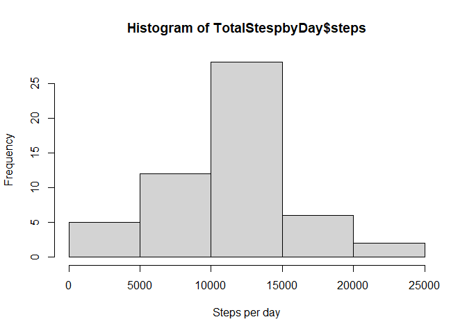
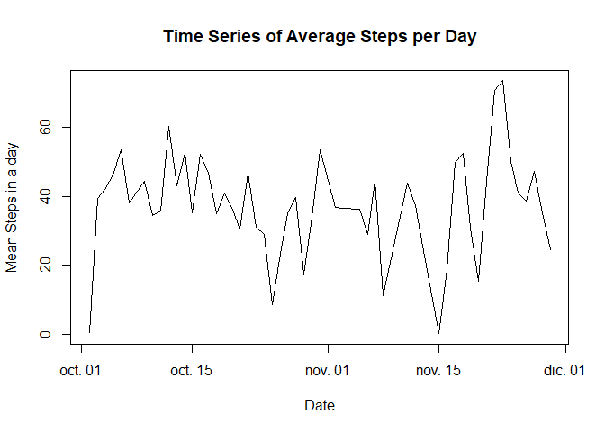
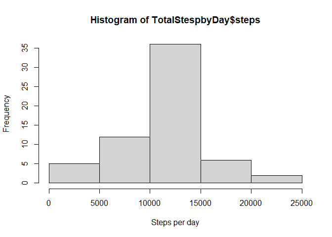
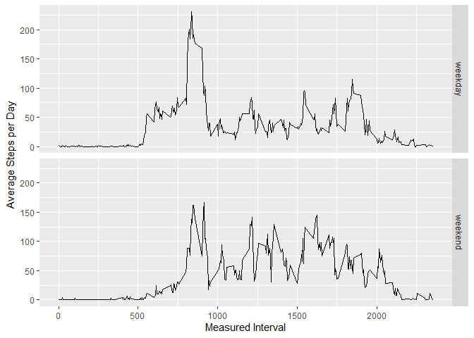

## Loading and preprocessing the data

The data to be read is the zipped file named "activity.csv"

```r
unzip(zipfile = "activity.zip")
RawData <- read.csv("activity.csv",header = TRUE, sep = ",")
head(RawData)
```

```
##   steps       date interval
## 1    NA 2012-10-01        0
## 2    NA 2012-10-01        5
## 3    NA 2012-10-01       10
## 4    NA 2012-10-01       15
## 5    NA 2012-10-01       20
## 6    NA 2012-10-01       25
```


## What is mean total number of steps taken per day?

1. Calculate the total number of steps taken per day

```r
RawData$date <- as.Date(as.character(RawData$date))
TotalStespbyDay <- aggregate(steps~date, RawData, sum)
```

2. Make a histogram of the total number of steps taken each day

```r
hist(x=TotalStespbyDay$steps, xlab = "Steps per day")
```

<!-- -->

3. Calculate and report the mean and median of the total number of steps taken per day

```r
mean(TotalStespbyDay$steps)
```

```
## [1] 10766.19
```

```r
median(TotalStespbyDay$steps)
```

```
## [1] 10765
```


## What is the average daily activity pattern?

1. Make a time series of the 5-minute interval (x-axis) and the average number of steps taken, averaged across all days (y-axis).

```r
MeanStepsbyDay <- aggregate(steps~date, RawData, mean)
plot(MeanStepsbyDay$steps~MeanStepsbyDay$date, type="l", xlab="Date", ylab="Mean Steps in a day", main="Time Series of Average Steps per Day")
```

<!-- -->

2. Which 5-minute interval, on average across all the days in the dataset, contains the maximum number of steps?

```r
MeanStepsbyInterval <- aggregate(steps~interval, RawData, mean)
MaxMSInterval <- MeanStepsbyInterval[MeanStepsbyInterval$steps==max(MeanStepsbyInterval$steps),1]
MaxMSInterval
```

```
## [1] 835
```


## Imputing missing values

1. Calculate and report the total number of missing values in the dataset (i.e. the total number of rows with NAs)

```r
sum(is.na(RawData[,1]))
```

```
## [1] 2304
```

2. Devise a strategy for filling in all of the missing values in the dataset. The strategy does not need to be sophisticated. For example, you could use the mean/median for that day, or the mean for that 5-minute interval, etc.


**Quantity of missing values in "date" and "interval" fields.**
Additional to the number of "steps", the dataset has the fields "date" and "interval", to be used for filling out the missing values of "steps". So it is convenient that the field selected has no missing values and it has steps' measures for every unique of its own values.


```r
MValues <- data.frame(sum(is.na(RawData$date)),sum(is.na(RawData$interval)))
colnames(MValues) <- c("date Missing values", "interval Missing Values")
MValues
```

```
##   date Missing values interval Missing Values
## 1                   0                       0
```

Since both "date" and "interval" have not missing values it would possible use the mean of either of the two fot filling out the missing values of the "steps" field. This means too that every possible value of theses two fields in fact exist in the sample's range.

However, It would be convenient to check out if every day and every interval has associated at least on measrument of the number of steps.

**Intervals with no any steps measurement.**

```r
NaInt <- aggregate(!is.na(steps)~interval, RawData, sum)
NaInt[NaInt[,2]==0,1]
```

```
## integer(0)
```
Each interval has at least one measurement corresponding to the number of steps.

**Days with no any steps measurement.**

```r
NaDate <- aggregate(!is.na(steps)~date, RawData, sum)
NaDate[NaDate[,2]==0,1]
```

```
## [1] "2012-10-01" "2012-10-08" "2012-11-01" "2012-11-04" "2012-11-09"
## [6] "2012-11-10" "2012-11-14" "2012-11-30"
```
There is 8 days without steps' measurements.

It is more convenient to select the "interval" filed for filling out the missig values of the "steps" filed.


3. Create a new dataset that is equal to the original dataset but with the missing data filled in.

```r
NAsRows <-is.na(RawData[,1])
ModifieData <- RawData
ModifieData$steps <- ifelse(NAsRows==TRUE,MeanStepsbyInterval[,2],RawData[,1])
```


4. Make a histogram of the total number of steps taken each day and Calculate and report the mean and median total number of steps taken per day. Do these values differ from the estimates from the first part of the assignment? What is the impact of imputing missing data on the estimates of the total daily number of steps?

```r
ModifieData$date <- as.Date(as.character(ModifieData$date))
TotalStespbyDay <- aggregate(steps~date, ModifieData, sum)
mean(TotalStespbyDay$steps)
```

```
## [1] 10766.19
```

```r
hist(x=TotalStespbyDay$steps, xlab = "Steps per day")
```

<!-- -->

```r
mean(TotalStespbyDay$steps)
```

```
## [1] 10766.19
```

```r
median(TotalStespbyDay$steps)
```

```
## [1] 10766.19
```


## Are there differences in activity patterns between weekdays and weekends?

1. Create a new factor variable in the dataset with two levels – “weekday” and “weekend” indicating whether a given date is a weekday or weekend day.

```r
library(lubridate)
```

```
## 
## Attaching package: 'lubridate'
```

```
## The following objects are masked from 'package:base':
## 
##     date, intersect, setdiff, union
```

```r
tday <- ifelse(wday(ModifieData$date) %in% c(7,1), "weekend", "weekday")
ModifieDataDay <- cbind(ModifieData,tday)
ModifieDataDay$tday <- as.factor(ModifieDataDay$tday)
```


2. Make a panel plot containing a time series plot (i.e.type = "l") of the 5-minute interval (x-axis) and the average number of steps taken, averaged across all weekday days or weekend days (y-axis). See the README file in the GitHub repository to see an example of what this plot should look like using simulated data.

```r
MeanStepsbyInterval <- aggregate(steps~interval+tday, ModifieDataDay, mean)
```


```r
library(ggplot2)
g <- ggplot(MeanStepsbyInterval, aes(x=interval, y=steps)) + geom_line() + facet_grid(vars(tday))+ylab(expression("Average Steps per Day")) + xlab(expression("Measured Interval"))
g
```

<!-- -->


